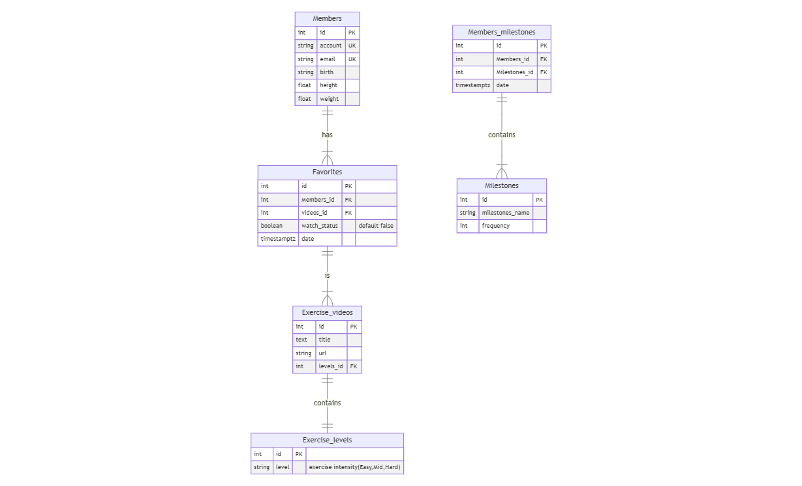

# Design Document

By Mavis Lai

Video overview: <URL HERE>

## Purpose
This database is design for people who want to exercise for healthy or keep good shape of their body.

**In Scope** 
Do some exercise at home and don't need professional equipments.
* Members: This table is to record member information, including account, birthday, email, height and weight.
* Exercises_levels: This table has different type of exercise intensity.There're 3 types of levels,like "easy","mid" and "hard".
* Exercide_videos: This table is to record url of videos and the column level_id is refers to the PRIMARY KEY in Exercise_levels table.
* Favorites: This table is a record of member what they like.Maybe they will watch video in the future,just like a bookmark.
* Members_milestones: This table is to record a member times of exercise.
* Milestones: This table is to record different times of exercise.

**Out of Scope** 
Eat a lot or lazy in life.

## Scope

The purpose of my database is to design for anyone who want to do some exercise at home.But People who is physical impairment or do not have enough spaces to do it.

## Functional Requirements
 * CRUD for members.
 * Members can choose which videos they want to exercise based on their abilities or preferences.

 Whether a member can lose the desired weight, exercise regularly, and eat a healthy diet are factors that the database cannot control.

## Representation
### Entities

#### Members:
the `Members` table includes:
* `id` which is a `Primary Key`, `unique` number assigned to each member in the database.And the id is incresement.
* `account` is a `unique` `varchar` to represent the member account of the database.
* `email` which is a `unique` `varchar` to get more information.
* `birth` is type of `varchar`,which mean the member's birthday,to know their ages.
* `height` is type of `varchar`,which is to get more suitable exercise plan for the member,need height,weight and age to accurate of calories and exercise volume.
* `weight` is type of `varchar`,which is to get more suitable exercise plan for the member,need height,weight and age to accurate of calories and exercise volume.
#### Milestones:
the `Milestones` table includes:
* `id` which is a `Primary Key`,`unique` number assigned to each row of data.
* `milestones_name` is type of `varchar`,which is a column defined as enum,values such as "exercise 3 times a week","exercise 5 times a week".
* `frequency` is type of `int`,to get the exercise times.
#### Members_milestones:
the `Member_milestones` table includes:
* `id` which is a `Primary Key`,`unique` number assigned to each row of data.
* `members_id` is `FOREIGN KEY` which refers to the `PRIMARY KEY` in `Members` table.
* `milestones_id` is `FOREIGN KEY` which refers to the `PRIMARY KEY` in `Milestones` table.In order to make members to know how frequently they do exercise.
* `date` is type of `timestamptz`.It's a column to record which date has the member done.
#### Exercise_levels:
the `Exercise_levels` table includes:
* `id` which is a `Primary Key`,`unique` number assigned to each row of data.
* `level` is type of `varchar`,which represent the different type of exercise intensity.It's defined as enum,values like "easy","mid" and "hard".
#### Exercise_videos:
the `Exercise_videos` table includes:
* `id` which is a `Primary Key`,`unique` number assigned to each row of data.
* `url` which is `text` to store the video url.
* `level_id` is `FOREIGN KEY` which refers to the `PRIMARY KEY` in `Exercise_levels` table.
#### Favorites:
the `Favorites` table includes:
* `id` which is a `Primary Key`,`unique` number assigned to each row of data.
* `members_id` is `FOREIGN KEY` which refers to the `PRIMARY KEY` in `Members` table.It's record which member has done.
* `videos_id` is `FOREIGN KEY` which refers to the `PRIMARY KEY` in `Exercise_videos` table.
* `watch_status` is type of `boolean` to record the member have watched it or not.It's associate with view `member_history`.
* `date` is type of `timestamptz`.It's a column to record which date has the member done.

### Relationships

The entity relationship diagram and the relationships between the entities in my database will shown on the image below.
    

Descriptions:
* There can be many members watch one exercise video at the same time in different places,but one member can watch one exercise video at a time.(Many to one relationship)
* A member can have many Favorites.(One to many relationship)
* One exercise video only have one exercise level,but one exercise level have many exercise videos.(One to many relationship)
* There can be many milestones for one member.(Many to one relationship)

## Optimizations

View:  
`member_history` to record what a member had done before. 
Index:  
`account`,`email` on table `Members`,`title` on table `Exercise_videos` and `milestones_name` on table `Milestones`.
Because some columns are unique,text or pk,it will be more effective than no index when execute SQL.

## Limitations

Can't customize a training project.  
Can't get precise data through "watch" exercise videos.The database can't get the condition of user.Such as it can't calculate how many calories a user burn.
